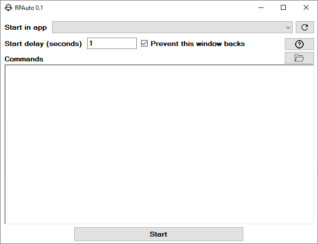

# RPAuto

RPAuto is a simple implementation of RPA (Robotic Process Automation). Used on day by day.

# Download

There is a [download version here](https://www.dropbox.com/s/jo96z2098twq57k/RPAuto.zip?dl=1).

# Screen

## Elements

- **Start in app** = If you want to specify a screen for your automation starts on it, select the application on the combo. To refresh this list, press the refresh button at side.

- **Start delay (seconds)** = A delay to RPA start to process commands.

- **Prevent this window backs** = When your commands are ended up, the main screen will be maximized back if this option be marked. This is useful when you are using TIMER or REPEAT commands.

- **Help** = Shows a file with these instructions.

- **Open file** = Open a command set previous typed.
- **Save file** = Save the current commands.

- **Commands**:

    - To use text free, use it without brackets.

    - **{WAIT:1000}** = Time to wait between commands (in milliseconds)

    - **{ENTER}** = Break lines

    - **{OPEN:*PATH_TO_OPEN*}** = Open a file, if it exists. 
        - Example: {Open:notepad}, {Open:Path\To\File}

    - **{TIMER:TIME} ... {COMMANDS} ... {TIMER}** = Create a loop with inside commands that repeats every "TIME" interval. 
        - Example: {TIMER:3000}{OPEN:calc}{TIMER}

    - **{REPEAT:COUNT} ... {COMMANDS} ... {REPEAT}** = Repeats a command block for COUNT times.
        - Example: {REPEAT:5}{OPEN:calc}{REPEAT}

    - **{CONTROL,SHIFT,ALT,LWIN,RWIN:KEY}** = To use modified keys. (Where KEY could be anything. Letters, numbers, etc. 
        - Example: {CONTROL,SHIFT:T} or {CONTROL:C})

Available special keys:

	LBUTTON
	RBUTTON
	CANCEL
	MBUTTON
	XBUTTON1
	XBUTTON2
	BACK
	TAB
	CLEAR
	RETURN
	SHIFT
	CONTROL
	MENU
	PAUSE
	CAPITAL
	HANGUL
	HANGUL
	HANGUL
	JUNJA
	FINAL
	HANJA
	HANJA
	ESCAPE
	CONVERT
	NONCONVERT
	ACCEPT
	MODECHANGE
	SPACE
	PRIOR
	NEXT
	END
	HOME
	LEFT
	UP
	RIGHT
	DOWN
	SELECT
	PRINT
	EXECUTE
	SNAPSHOT
	INSERT
	DELETE
	HELP
	0
	1
	2
	3
	4
	5
	6
	7
	8
	9
	A
	B
	C
	D
	E
	F
	G
	H
	I
	J
	K
	L
	M
	N
	O
	P
	Q
	R
	S
	T
	U
	V
	W
	X
	Y
	Z
    *
    /
    |
    ?
    \
    !
    @
    #
    $
    %
    ¨
    &
    *
    (
    )
    _
    -
    +
    =
	LWIN
	RWIN
	APPS
	SLEEP
	NUMPAD0
	NUMPAD1
	NUMPAD2
	NUMPAD3
	NUMPAD4
	NUMPAD5
	NUMPAD6
	NUMPAD7
	NUMPAD8
	NUMPAD9
	MULTIPLY
	ADD
	SEPARATOR
	SUBTRACT
	DECIMAL
	DIVIDE
	F1
	F2
	F3
	F4
	F5
	F6
	F7
	F8
	F9
	F10
	F11
	F12
	NUMLOCK
	SCROLL
	LSHIFT
	RSHIFT
	LCONTROL
	RCONTROL
	LMENU
	RMENU

See some sample files at "Samples" folder on this project.

**LIFE SAVER** : When you want aborting an execution, press **CONTROL** and **ESC** keys together.

# Useful links

- [Input Simulator](http://inputsimulator.codeplex.com/)
